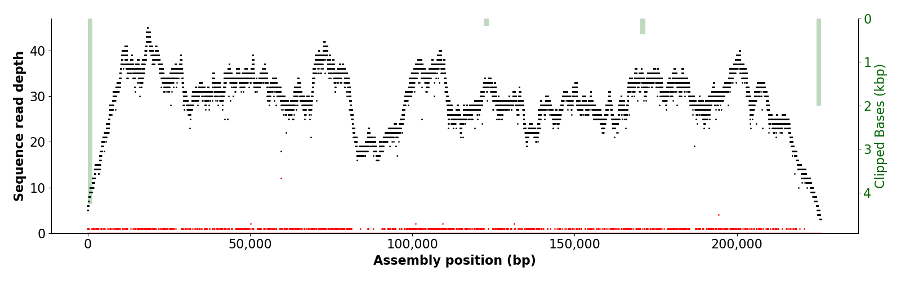

# Nucfreq plots
Script for making nucleotide frequency plots 


# Usage 
```
usage: NucPlot.py [-h] [-d] [--legend] [--zerostart] [-a] [-r REPEATMASKER]
                  [--regions [REGIONS [REGIONS ...]]] [--bed BED] [-y YLIM]
                  [--height HEIGHT] [-w WIDTH] [-t THREADS] [--header]
                  [--psvsites PSVSITES] [-s] [-c MINCLIP]
                  infile outfile

positional arguments:
  infile                input bam file
  outfile               output plot file

optional arguments:
  -h, --help            show this help message and exit
  -d
  --legend
  --zerostart
  -a                    output all positions (default: False)
  -r REPEATMASKER, --repeatmasker REPEATMASKER
                        rm out to add to plot (default: None)
  --regions [REGIONS [REGIONS ...]]
                        regions in this format (.*):(\d+)-(\d+) (default:
                        None)
  --bed BED             bed file with regions to plot (default: None)
  -y YLIM, --ylim YLIM  max y axis limit (default: None)
  --height HEIGHT       figure height (default: 9)
  -w WIDTH, --width WIDTH
                        figure width (default: 16)
  -t THREADS, --threads THREADS
                        [8] (default: 8)
  --header
  --psvsites PSVSITES   CC/mi.gml.sites (default: None)
  -s, --soft
  -c MINCLIP, --minclip MINCLIP
                        min number of clippsed bases in order to be displayed
                        (default: 1000)
```
                        
