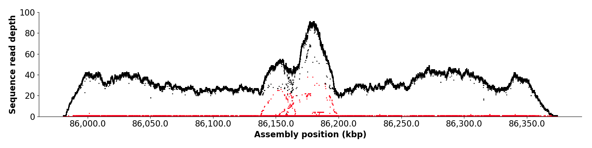

# NucFreq plots
Script for making nucleotide frequency plots 


# Usage 
```
usage: NucPlot.py [-h] [-d] [--legend] [--zerostart] [-a] [-r REPEATMASKER]
                  [--regions [REGIONS [REGIONS ...]]] [--bed BED] [-y YLIM]
                  [--height HEIGHT] [-w WIDTH] [-t THREADS] [--header]
                  [--psvsites PSVSITES] [-s] [-c MINCLIP]
                  infile outfile

positional arguments:
  infile                input bam file
  outfile               output plot file

optional arguments:
  -h, --help            show this help message and exit
  -d
  --legend
  --zerostart
  -a                    output all positions (default: False)
  -r REPEATMASKER, --repeatmasker REPEATMASKER
                        rm out to add to plot (default: None)
  --regions [REGIONS [REGIONS ...]]
                        regions in this format (.*):(\d+)-(\d+) (default:
                        None)
  --bed BED             bed file with regions to plot (default: None)
  -y YLIM, --ylim YLIM  max y axis limit (default: None)
  --height HEIGHT       figure height (default: 9)
  -w WIDTH, --width WIDTH
                        figure width (default: 16)
  -t THREADS, --threads THREADS
                        [8] (default: 8)
  --header
  --psvsites PSVSITES   CC/mi.gml.sites (default: None)
  -s, --soft
  -c MINCLIP, --minclip MINCLIP
                        min number of clippsed bases in order to be displayed
                        (default: 1000)
```
      

### Detecting heterozygous sites with NucFreq
In order to detect heterozygous sites genome-wide, we first aligned CHM13 PacBio
HiFi reads to the entire CHM13 v1.0 assembly using pbmm2 or Winnowmap with the 
following parameters: 
```
--log-level DEBUG --preset SUBREAD --min-length 5000 -j 8
```
for pbmm2 or 
```
--MD -W repetitive_k15.txt -Ha -x map-pb
```
for Winnowmap.

Then, we filtered the alignments to remove secondary and partial alignment using SAMtools
flag 2308. We used `NucPlot.py` to determine the frequency of the first and second most 
common bases in the aligned PacBio HiFi reads with the following command: 
```
NucPlot.py --obed {output.bed} --bed {region.bed} --minobed 2 {input.bam} {output.png}
```
Then, we used the resulting bed file and the `hetDetection.R` script
to identify regions where the second most common base 
was present in at least 10% of reads in at least 5 positions within a 500 bp region.

Section and `hetDetection.R` written by G. Logsdon. 

## TODO
 - Make the colors of repeatmakser stable in NucPlot.py


